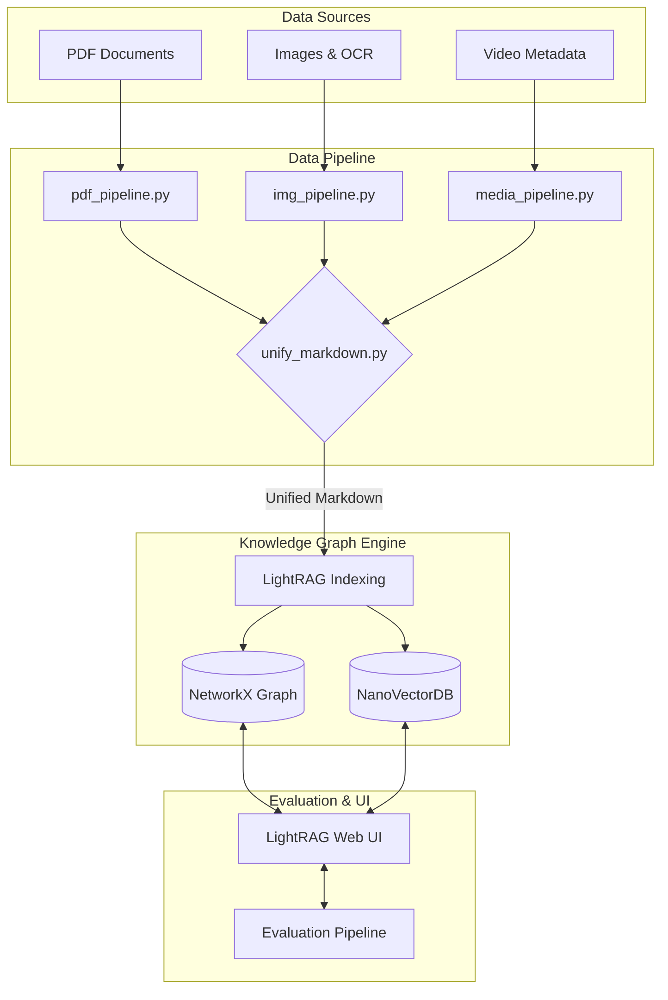

<div align="center">
  
  <h1>🛸 UFO BOT — Graph-Based RAG</h1>
  <p><strong>A Multi-Modal Knowledge Graph Chatbot for UAP/UFO Documentation</strong></p>
  
  [](https://www.python.org/)
  [](https://github.com/HKUDS/LightRAG)
  [](https://ollama.ai/)
  [](LICENSE)
</div>

---

## 📖 Overview

**UFO BOT** is an advanced Retrieval-Augmented Generation (RAG) system built to parse, structure, and query a complex corpus of Unidentified Anomalous Phenomena (UAP) documents. 

Unlike traditional vector-based RAGs, this project utilizes **LightRAG** to build a comprehensive **Knowledge Graph**, linking entities (agencies, locations, events) across heterogeneous data formats. It unifies scattered data from PDFs, image metadata, and video logs into a single, cohesive brain that can be queried entirely locally using consumer-grade hardware.

## ✨ Key Features

- 🧠 **Graph-Based Retrieval (LightRAG):** Extracts and connects entities and relationships to answer complex, multi-hop questions.
- 📂 **Multi-Modal Ingestion Pipeline:** Unifies data from textual PDFs, Image OCR, and Media/Video metadata into standard Markdown for ingestion.
- 🔒 **100% Local Processing:** Powered entirely by local models via **Ollama**, ensuring privacy and zero API costs.
- 📊 **Automated Evaluation Pipeline:** Includes a comprehensive benchmarking script utilizing LLM-as-a-Judge, ROUGE-L, and Semantic Similarity metrics to grade response quality.
- ⚡ **Optimized for Consumer GPUs:** Tuned chunking and concurrency settings specifically for stability on an RTX 3060.

---

## 🏗️ Architecture



---

## 🛠️ Technology Stack

- **Core Engine:** [LightRAG](https://github.com/HKUDS/LightRAG)
- **Local LLM Server:** [Ollama](https://ollama.ai/)
- **LLM Model (Extraction & Generation):** `qwen2.5:7b`
- **Embedding Model:** `nomic-embed-text`
- **Graph Storage:** NetworkX
- **Vector Storage:** NanoVectorDB
- **Evaluation:** Python, Pandas, Chart.js (HTML Reports)

---

## 🚀 Getting Started

### 1. Prerequisites
- **Ollama** installed and running on your machine.
- **Conda** or **Miniconda**.
- Minimum Hardware: NVIDIA RTX 3060 (12GB VRAM recommended for stable 7B model execution).

### 2. Environment Setup

```bash
# Clone the repository
git clone https://github.com/yourusername/UFO-BOT.git
cd UFO-BOT

# Create and activate conda environment
conda env create -f environment.yml
conda activate ufo_rag

# Pull required models via Ollama
ollama pull qwen2.5:7b
ollama pull nomic-embed-text
```

### 3. Data Processing

Run the unification pipeline to gather all processed PDFs, images, and media logs into a single input directory:

```bash
python pipeline/unify_markdown.py
```

### 4. Running the Chatbot

Start the LightRAG server:

```bash
lightrag-server
```
*Access the Web UI at `http://localhost:9621` to process documents and query the Knowledge Graph.*

---

## 📈 Automated Evaluation

This project includes a robust evaluation pipeline to measure the chatbot's quality across four retrieval modes (`naive`, `local`, `global`, `hybrid`).

### Metrics Measured:
- **Response Latency** (Seconds)
- **ROUGE-L Score** (Lexical overlap)
- **Semantic Similarity** (Cosine distance via `nomic-embed-text`)
- **Faithfulness Score (0-5)** (LLM-as-a-Judge using `qwen2.5:7b`)

### Run Evaluation:
```bash
python pipeline/eval_pipeline.py
```

### Summary of Findings:
- **Hybrid Mode** achieved the highest performance (Highest ROUGE-L and Semantic Similarity of ~0.78), proving the effectiveness of combining graph-based and vector-based retrieval.
- **Faithfulness:** Scored an impressive average of **3.9/5**, demonstrating strong adherence to the provided context and minimal hallucination.

*Visual HTML reports are automatically generated in `output/eval_results/eval_report.html`.*

---

## 🤝 Contributing
Contributions are welcome! Please feel free to submit a Pull Request.

## 📝 License
This project is licensed under the MIT License - see the [LICENSE](LICENSE) file for details.
